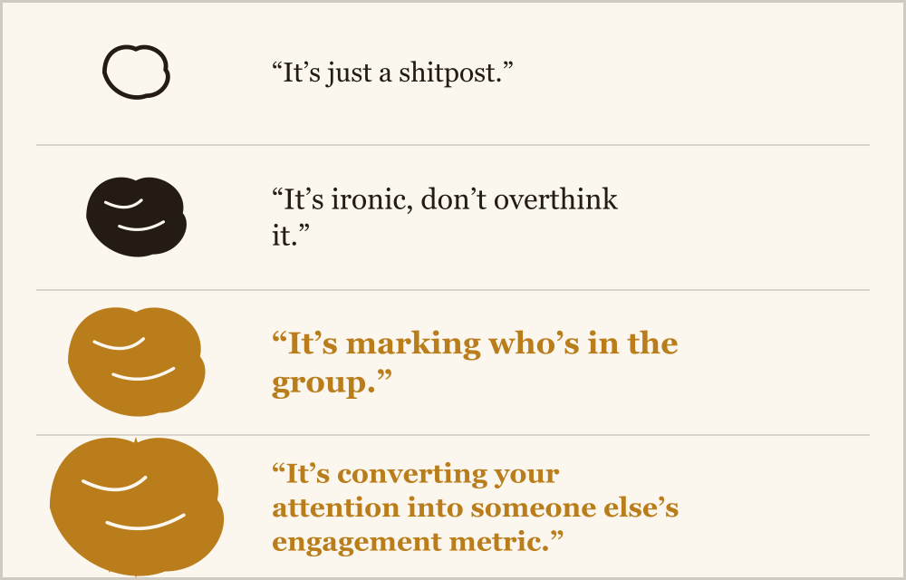

{/* _class: impact */}

# Prolegomena

**A method, before a single doctrine.**

---

{/* _class: quote */}

> "Read for what it's doing, not what it claims to be doing."

---

## Two ways to read a post

- **What it claims** — informs, jokes, vents, asks a question
- **What it does** — recruits a reaction, marks who's in the group, kills time on purpose

This course only ever reads for the second one.

---

## The hermeneutics of the shitpost, expanding brain edition



---

## What is "brain rot"?

Dictionaries only started defining it a couple of years ago: the supposed
decline of your mental state from too much low-quality content online.

Coined as a joke and a worry at once — this course keeps the diagnosis and
drops the worry.

---

{/* _class: quote */}

> "What looks like decay from outside a feed looks, from inside one, like a
> set of untaught skills."

---

## Why it matters

- algorithmic feeds already arrange a huge share of a generation's attention
- refusing to study that doesn't shrink it — it just hands the terrain to whoever already knows it best
- a theology beats an etiquette lecture

---

{/* _class: banner */}

## From subculture to mainstream

This vocabulary used to stay inside the group that made it. Now it's in
dictionaries, marketing decks, and political speeches — because being legible
online means speaking the feed's register.

A practice with its own scripture, liturgy, saints and missionaries has
outgrown "guilty pleasure."

---

## Why this matters for the whole semester

Every week from here trains a practice most people already half-do, and gives
it a name, a technique, a history, and a standard for doing it well.

- wasting time online
- engaging in slop
- rage-baiting
- doomscrolling on purpose

---

{/* _class: centered */}

## The telos

Wasting time online isn't this course's guilty aside.

It's the outcome every later week is building toward.

---

## Twelve weeks, one method

```
1  Prolegomena           7  Liturgy & the Trend Calendar
2  Cosmogony              8  Homiletics
3  Canon & Scripture      9  Hagiography & Iconography
4  Apocrypha              10 Prophecy & False Prophets
5  Indulgences            11 Glossolalia
6  Asceticism             12 Missiology
```

---

{/* _class: impact */}

## Read everything twice this semester.

Once for what it says. Once for what it's doing.
